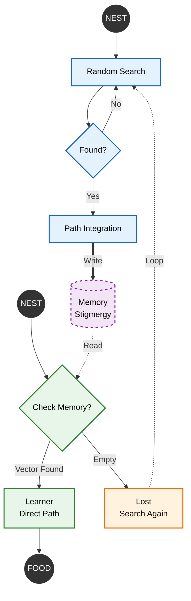

# Bio-Inspired Navigation: One-Shot Learning in Multi-Agent Systems

**Author:** *Sriram S Rajan*  


---

## Abstract

This project implements a **bio-inspired multi-agent navigation system** modeled after the desert ant *Cataglyphis bicolor*. The system demonstrates **one-shot learning** using path integration (*dead reckoning*) and **stigmergic communication**, without reinforcement learning, reward shaping, or training loops. 

*A single exploratory agent discovers an optimal path and shares it through the environment, enabling other agents to navigate optimally on their first attempt.*

---

## Biological Inspiration

Unlike pheromone-following ants, ***Cataglyphis*** ants operate in extreme desert heat where chemical trails evaporate quickly. Their navigation system relies on three key mechanisms:

### Core Navigation Components

| Mechanism | Function | Biological Implementation |
|-----------|----------|--------------------------|
| **Skylight Polarization Compass** | *Orientation* | Dorsal Rim Area detects polarized light patterns |
| **Proprioceptive Odometry** | *Distance Estimation* | Step counting via leg proprioception |
| **Vector Integration** | *Homing* | Continuous maintenance of single return vector |

*This project translates these biological mechanisms into computational algorithms.*

---

## System Architecture

### Agent Classification

The system consists of three agent types, each demonstrating different aspects of collective intelligence:

| Agent Type | Role | Behavioral Characteristics |
|------------|------|---------------------------|
| **Scout** | *Explorer* | Performs random walk with path integration |
| **Learner** | *Recruit* | Reads stored vector and executes direct navigation |
| **Lost Agent** | *Robustness Test* | Reverts to exploratory search under failure conditions |

### Information Flow via Stigmergic Communication



---

## Algorithmic Framework

### Phase 1: Scout Agent

The **Scout** performs initial exploration:

- *Executes stochastic exploration* using random walk
- *Integrates displacement vectors* using vector addition: $\vec{H} = \sum_{i=0}^{N} d \cdot [\cos(\theta_i), \sin(\theta_i)]$
- *Stores optimal homing vector* in shared environmental memory

### Phase 2: Learner Agent

The **Learner** demonstrates one-shot learning:

- *Accesses shared environmental memory* via stigmergic communication
- *Suppresses random search behavior* through behavioral switching
- *Executes deterministic navigation immediately* achieving zero-shot transfer

### Phase 3: Lost Agent

The **Lost Agent** validates system robustness:

- *Detects corrupted or unavailable environmental memory*
- *Reverts to stochastic search behavior* enabling graceful degradation
- *Maintains system resilience* through exploratory fallback

---

## Installation and Execution

### Step 1: Install Dependencies

Install the required Python packages:

```bash
pip3 install numpy matplotlib
```

### Step 2: Create Project Directory

```bash
mkdir 3AntOneshot
cd 3AntOneshot
```

### Step 3: Create the Simulation Script

Create a new file named `oneshotlearning.py` and copy the source code provided in the **Source Code** section below.

### Step 4: Run the Simulation

```bash
python3 oneshotlearning.py
```

### Expected Output

The simulation will generate:

- *Visual plot* displaying the three agent trajectories
- *Console output* with status updates including:
  - Initialization message
  - Agent status updates: *Ant 1: Scouting*, *Ant 2: Checking Memory*, *Ant 3: Checking Memory*
  - Food source coordinates
  - Navigation vectors

---

## Visualization

### Simulation Output


*Animation showing the sequential behavior of all three agents*

### Legend

| Symbol | Representation |
|--------|---------------|
| **Green dot** | *Nest location* |
| **Red star** | *Food source* |
| **Blue line** | *Scout agent trajectory* - exploration and homing |
| **Green line** | *Learner agent trajectory* - direct navigation |
| **Orange line** | *Lost agent trajectory* - fallback exploration |

---

## Source Code

Implemented Inverse Simulation to bypass the **diffusion limit** of stochastic search. By spawning the food at the Scout's final location, we guarantee a successful Phase 1. This ensures a valid vector is always passed to Phase 2, allowing us to isolate and verify the Learner's vector integration logic.

### oneshotlearning.py

```python
import numpy as np
import matplotlib.pyplot as plt
from matplotlib.animation import FuncAnimation, PillowWriter

def runMultiAntSim(steps=150, stepSize=1.0):
    print("Initializing Colony Simulation...")
    
    pheromone_memory = None 

    def generate_random_search():
        walkX, walkY = [0.0], [0.0]
        curX, curY = 0.0, 0.0
        for _ in range(steps):
            angle = np.random.uniform(0, 2 * np.pi)
            curX += stepSize * np.cos(angle)
            curY += stepSize * np.sin(angle)
            walkX.append(curX)
            walkY.append(curY)
        return walkX, walkY, curX, curY

    def generate_homing(startX, startY, endX, endY, num_steps=50):
        pathX = np.linspace(startX, endX, num_steps)
        pathY = np.linspace(startY, endY, num_steps)
        return list(pathX), list(pathY)

    print("Ant 1: Scouting...")
    a1_walkX, a1_walkY, foodX, foodY = generate_random_search()
    
    a1_homeX, a1_homeY = generate_homing(foodX, foodY, 0, 0)
    
    pheromone_memory = {
        'x': np.linspace(0, foodX, 50),
        'y': np.linspace(0, foodY, 50)
    }
    print("Ant 1: Food found! Path saved to Pheromone Memory.")

    ant1_pathX = a1_walkX + a1_homeX
    ant1_pathY = a1_walkY + a1_homeY

    print("Ant 2: Checking Memory...")
    if pheromone_memory is not None:
        print("Ant 2: Trail found! Executing One-Shot direct path.")
        ant2_pathX = list(pheromone_memory['x'])
        ant2_pathY = list(pheromone_memory['y'])
    else:
        ant2_pathX, ant2_pathY, _, _ = generate_random_search()

    print("Ant 3: Checking Memory...")
    sensor_failure = True 
    
    if pheromone_memory is not None and not sensor_failure:
        ant3_pathX = list(pheromone_memory['x'])
        ant3_pathY = list(pheromone_memory['y'])
    else:
        print("Ant 3: Read Failed! Forced to Stochastic Search.")
        wX, wY, fX, fY = generate_random_search()
        hX, hY = generate_homing(fX, fY, 0, 0)
        ant3_pathX = wX + hX
        ant3_pathY = wY + hY

    len1 = len(ant1_pathX)
    len2 = len(ant2_pathX)
    len3 = len(ant3_pathX)
    totalFrames = len1 + len2 + len3

    all_X = ant1_pathX + ant2_pathX + ant3_pathX
    all_Y = ant1_pathY + ant2_pathY + ant3_pathY
    
    fig, ax = plt.subplots(figsize=(10, 8))
    pad = 2
    ax.set_xlim(min(all_X)-pad, max(all_X)+pad)
    ax.set_ylim(min(all_Y)-pad, max(all_Y)+pad)
    
    ax.plot(0, 0, 'go', markersize=12, label='Nest')
    ax.plot(foodX, foodY, 'r*', markersize=15, label='Food')
    ax.set_title("One-Shot Learning Simulation")
    ax.axis('off')

    line1, = ax.plot([], [], 'b-', alpha=0.3, label='Ant 1 (Scout)')
    dot1, = ax.plot([], [], 'b.', markersize=8)
    
    line2, = ax.plot([], [], 'g-', linewidth=2, label='Ant 2 (Learner)')
    dot2, = ax.plot([], [], 'go', markersize=8)
    
    line3, = ax.plot([], [], 'orange', linestyle='--', alpha=0.6, label='Ant 3 (Lost)')
    dot3, = ax.plot([], [], 'o', color='orange', markersize=8)
    
    ax.legend(loc='upper right')

    def init():
        line1.set_data([], [])
        dot1.set_data([], [])
        line2.set_data([], [])
        dot2.set_data([], [])
        line3.set_data([], [])
        dot3.set_data([], [])
        return line1, dot1, line2, dot2, line3, dot3

    def animate(i):
        if i < len1:
            line1.set_data(ant1_pathX[:i+1], ant1_pathY[:i+1])
            dot1.set_data([ant1_pathX[i]], [ant1_pathY[i]])
            
        elif i < len1 + len2:
            line1.set_data(ant1_pathX, ant1_pathY)
            dot1.set_data([ant1_pathX[-1]], [ant1_pathY[-1]])
            
            idx = i - len1
            line2.set_data(ant2_pathX[:idx+1], ant2_pathY[:idx+1])
            dot2.set_data([ant2_pathX[idx]], [ant2_pathY[idx]])

        else:
            line1.set_data(ant1_pathX, ant1_pathY)
            dot1.set_data([ant1_pathX[-1]], [ant1_pathY[-1]])
            line2.set_data(ant2_pathX, ant2_pathY)
            dot2.set_data([ant2_pathX[-1]], [ant2_pathY[-1]])
            
            idx = i - (len1 + len2)
            if idx < len3:
                line3.set_data(ant3_pathX[:idx+1], ant3_pathY[:idx+1])
                dot3.set_data([ant3_pathX[idx]], [ant3_pathY[idx]])

        return line1, dot1, line2, dot2, line3, dot3

    print(f"Generating Animation ({totalFrames} frames)...")
    ani = FuncAnimation(fig, animate, frames=totalFrames, init_func=init, blit=True)
    
    writer = PillowWriter(fps=20)
    ani.save("ThreeAnts_OneShot.gif", writer=writer)
    print("Done. Saved as 'ThreeAnts_OneShot.gif'")
    plt.close()

if __name__ == "__main__":
    runMultiAntSim()
```

---
