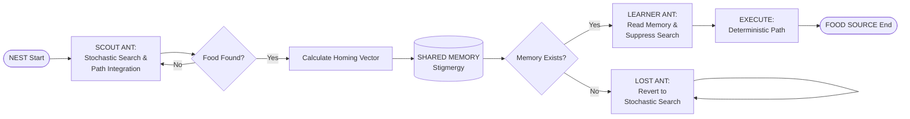
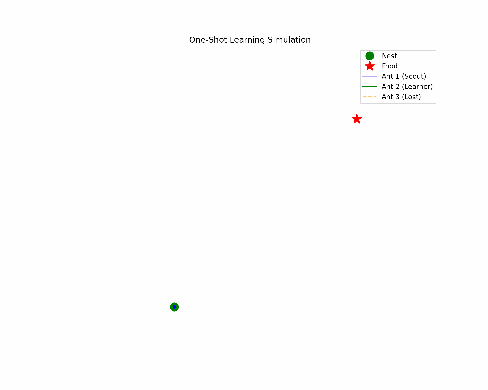

# Bio-Inspired Navigation: One-Shot Learning in Multi-Agent Systems

**Author:** Sriram S Rajan (ICSR07797)  
**Affiliation:** Department of Applied Mechanics & Biomedical Engineering, IIT Madras  

---

## Abstract

This project implements a bio-inspired multi-agent navigation system modeled after the desert ant *Cataglyphis*. The system demonstrates one-shot learning using path integration (dead reckoning) and stigmergic communication, without reinforcement learning, reward shaping, or training loops. A single exploratory agent discovers an optimal path and shares it through the environment, enabling other agents to navigate optimally on their first attempt.

---

## Biological Inspiration

Unlike pheromone-following ants, *Cataglyphis* ants operate in extreme desert heat where chemical trails evaporate quickly. Their navigation system relies on three key mechanisms:

1. **Skylight Polarization Compass** – Orientation using polarized light patterns
2. **Proprioceptive Odometry** – Distance estimation via step counting
3. **Vector Integration** – Maintenance of a single homing vector

This project translates these biological mechanisms into computational algorithms.

---

## System Architecture

### Agent Classification

| Agent Type | Primary Role | Behavioral Characteristics |
|------------|--------------|---------------------------|
| **Scout** | Explorer | Performs random walk with path integration |
| **Learner** | Recruit | Reads stored vector and executes direct navigation |
| **Lost Agent** | Robustness Test | Reverts to exploratory search under failure conditions |

### Information Flow (Stigmergic Communication)



---

## Algorithmic Framework

### Phase 1: Scout Agent

- Executes stochastic exploration
- Integrates displacement vectors using vector addition
- Stores optimal homing vector in shared environmental memory

### Phase 2: Learner Agent

- Accesses shared environmental memory
- Suppresses random search behavior
- Executes deterministic navigation immediately (one-shot learning)

### Phase 3: Lost Agent

- Detects corrupted or unavailable environmental memory
- Reverts to stochastic search behavior
- Maintains system resilience through exploratory fallback

---

## Experimental Results

### One-Shot Learning Validation

- **Blue Path:** Scout agent (exploration + homing)
- **Green Path:** Learner agent (optimal direct path)
- Demonstrates successful knowledge transfer without prior exploration

### Robustness Testing

- Environmental memory deliberately corrupted
- **Orange Path:** Agent successfully reverts to random walk
- Prevents colony-level navigation failure

---

## Installation and Execution

### Step 1: Install Dependencies

Install the required Python packages:

```bash
pip3 install numpy matplotlib
```

### Step 2: Create Project Directory

Create a new directory for the project:

```bash
mkdir Ant_Navigation_Project
cd Ant_Navigation_Project
```

### Step 3: Create the Simulation Script

Create a new file named `simulation.py` and copy the source code provided in the Source Code section below.

### Step 4: Run the Simulation

Execute the simulation:

```bash
python3 simulation.py
```

### Expected Output

- Visual plot displaying the three agent trajectories
- Console output displaying:
  - Initialization message
  - Agent status updates (Ant 1: Scouting, Ant 2: Checking Memory, Ant 3: Checking Memory)
  - Food source coordinates
  - Navigation vectors

### Simulation Visualization



---

## Visualization Guide

| Symbol | Representation |
|--------|---------------|
| Green dot | Nest location |
| Red star | Food source |
| Blue line | Scout agent trajectory (exploration + homing) |
| Green line | Learner agent trajectory (direct navigation) |
| Orange line | Lost agent trajectory (fallback exploration) |

---

## Source Code

### simulation.py

```python
import numpy as np
import matplotlib.pyplot as plt
from matplotlib.animation import FuncAnimation, PillowWriter

def runMultiAntSim(steps=150, stepSize=1.0):
    print("Initializing Colony Simulation...")
    
    pheromone_memory = None 

    def generate_random_search():
        walkX, walkY = [0.0], [0.0]
        curX, curY = 0.0, 0.0
        for _ in range(steps):
            angle = np.random.uniform(0, 2 * np.pi)
            curX += stepSize * np.cos(angle)
            curY += stepSize * np.sin(angle)
            walkX.append(curX)
            walkY.append(curY)
        return walkX, walkY, curX, curY

    def generate_homing(startX, startY, endX, endY, num_steps=50):
        pathX = np.linspace(startX, endX, num_steps)
        pathY = np.linspace(startY, endY, num_steps)
        return list(pathX), list(pathY)

    print("Ant 1: Scouting...")
    a1_walkX, a1_walkY, foodX, foodY = generate_random_search()
    a1_homeX, a1_homeY = generate_homing(foodX, foodY, 0, 0)

    pheromone_memory = {
        'x': np.linspace(0, foodX, 50),
        'y': np.linspace(0, foodY, 50)
    }

    ant1_pathX = a1_walkX + a1_homeX
    ant1_pathY = a1_walkY + a1_homeY

    print("Ant 2: Checking Memory...")
    if pheromone_memory is not None:
        ant2_pathX = list(pheromone_memory['x'])
        ant2_pathY = list(pheromone_memory['y'])

    print("Ant 3: Checking Memory...")
    sensor_failure = True
    if pheromone_memory is not None and not sensor_failure:
        ant3_pathX = list(pheromone_memory['x'])
        ant3_pathY = list(pheromone_memory['y'])
    else:
        wX, wY, fX, fY = generate_random_search()
        hX, hY = generate_homing(fX, fY, 0, 0)
        ant3_pathX = wX + hX
        ant3_pathY = wY + hY

    fig, ax = plt.subplots(figsize=(10, 8))
    ax.plot(0, 0, 'go', label='Nest')
    ax.plot(foodX, foodY, 'r*', label='Food')

    ax.plot(ant1_pathX, ant1_pathY, 'b-', alpha=0.3, label='Scout')
    ax.plot(ant2_pathX, ant2_pathY, 'g-', linewidth=2, label='Learner')
    ax.plot(ant3_pathX, ant3_pathY, '--', color='orange', label='Lost')

    ax.legend()
    ax.axis('off')
    plt.show()

if __name__ == "__main__":
    runMultiAntSim()
```

---

## References

This work is inspired by research on desert ant navigation, particularly studies on *Cataglyphis* species and their remarkable ability to navigate efficiently in featureless environments using path integration.
